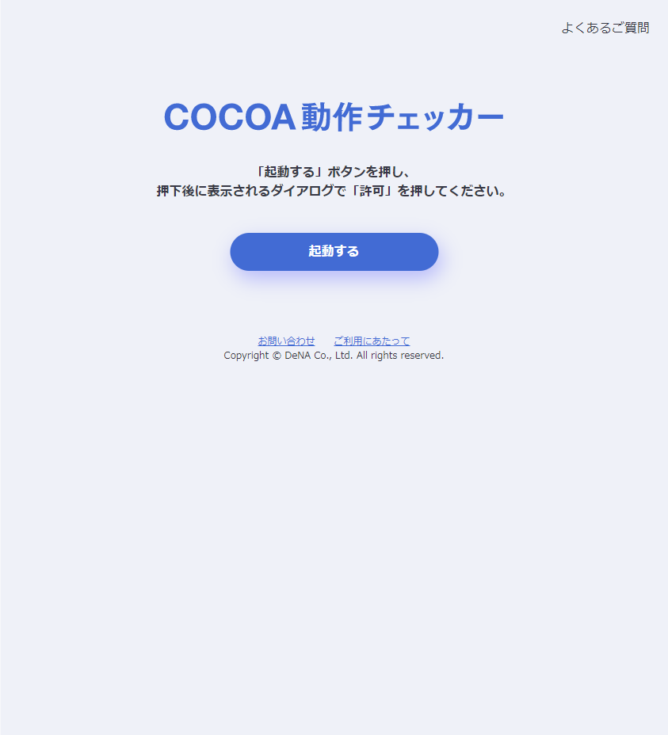
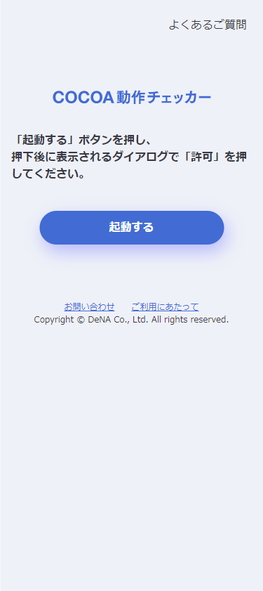

# COCOA動作チェッカー 機能と使い方 (2021/01/25版)

お問い合わせ先：COCOA動作チェッカー事務局 cocoa-checker@dena.com

## 本サイト開発の狙い

- 新型コロナウイルス接触確認アプリ（COCOA）導入済みスマートフォンにおけるアプリの稼働状況可視化を通じた稼働率の向上を計る
- 他者との接触が多い場の利用者に対して、COCOAの利点説明・周囲の導入台数を伝え、COCOAインストール率の向上を促す

## 使い方（本サイトの利用シーン）

- 飲食店などの施設が用意したタブレット/スマートフォンで本サイトにアクセス
- 利用者が施設へ入場する際、施設側の端末に個人のスマートフォンをかざしてCOCOAが正しく動作しているかをチェックする
- COCOAの信号が確認できなかった場合は、画面上の案内を通じて、COCOAのインストール、あるいはスマホの設定修正を行う

### 利用にCOCOAの利用を強く推奨している施設で利用される場合

- まず、「COCOAの利用の強い推奨」自体についてですが、COCOAに対応するスマートフォンを持たない利用者が不利益とならないよう留意する必要があると考えます
- 留意をした上で、強い推奨を行う施設でご利用される場合には、「COCOA動作チェッカー」が正しくない判定をする可能性があることから、COCOA自体の画面確認も同時に行うことや、「COCOA動作チェッカー」で動作確認が行えなかった場合の対応方法も用意いただくこともご検討いただくようお願いいたします

<small><small>正しくない動作の例 : 端末にかざしていないスマホの信号強度変化に反応して「動作している」と判定する（周囲のスマホ全てが発信するCOCOAの信号の強度の変化から動作判定を行うため）、端末にスマホをかざしても「動作していない」と判定する（ごく一部の機種ではBluetoothの信号の強度が弱く測定されることから、信号強度が十分に変化しないため）</small></small>

## 推奨環境

### 施設側の端末 : タブレット/スマートフォン

- Android 6.0 以上（Chrome for Android）
  - 一部非推奨端末あり、iOSは対象外
  - 非推奨端末(2021/01/25現在)：ASUS Nexus7(2013), Galaxy S7 edge

### 利用者側の端末 スマートフォン(/タブレット)

- iOS 13.5 以上
- Android 6.0 以上

※COCOAの動作環境を示しています

## 使い方

### 施設側の端末操作 : サイトにアクセスし、起動ボタンをタップして、動作確認が可能な状態にする

- 設定変更が必要な場合、サイトが自動判断し、必要な修正方法だけを表示します
  - 大半の端末では、初回起動時に1,2個の設定変更が要求されるが、2回目以降の起動では、画面を2回タップすれば起動完了する（次ページ以降参照）
  - ※利用登録等の手続きは不要ですが、どのような場で利用されているかを把握したいため、問い合わせ窓口 cocoa-checker@dena.com 宛てに、活用報告をいただけますと幸いです
- 一度起動すれば、利用者等により、端末の電源が切られる・Chromeを閉じる等のイレギュラー操作がされない限り、施設側で端末の操作は不要です

### 利用者側の端末操作 : 画面の案内に従い、所有するスマートフォン等を画面にかざして、表示される結果を確認する

- 一定時間内にCOCOAの発する信号を確認できた場合には、確認出来たメッセージを表示します
- 一定時間内にCOCOAの発する信号を確認できなかった場合には、主なエラー原因に対する対応方法を表示します

## 施設側の端末操作　①起動画面

- 特設サイト（ https://dena.github.io/cocoa-checker ）にアクセスし、起動するボタンをタップすると、端末自体がCOCOA動作チェッカーの動作環境を満たしているか確認を行う
- 動作環境を満たし必要な設定済みであれば、スキャン許可を求めるダイアログが表示される（⇒②Bluetooth許可画面）
- 必要な設定がされていない場合は、設定方法を説明する画面が表示される（⇒①-1 設定ガイダンス）

| タブレット画面 | スマートフォン画面 | 特設サイトQRコード |
| --- | --- | --- |
|  |  |  |

## 施設側の端末操作　①-1 設定ガイダンス

- 必要な設定がされていない場合はこの画面に遷移、満たしていない条件のみが表示され、下矢印をタップで詳細説明が表示される
- 修正が終わったら、TOPにもどるボタンをタップで「①起動画面」へ戻る

### 初回起動時の留意点
- 多くの端末の初回起動時には、「Chromeのテスト中機能を有効にする必要があります」が表示される
- テスト中機能を有効にする画面は、誤設定を防止するChromeの仕様上、リンクをタップしても開けないため、本サイトではアドレスの文字列をコピーした状態で新しいタブが開くようにしている
- 「ここをクリック」で開いた新しいタブのアドレス欄に「貼り付け」を⾏うだけで設定を行うページのアドレスが入力される

| 画面 |
| --- |
|  |

## 施設側の端末操作　② Bluetooth許可画面　③端末性能の測定画面

- 許可をタップで左側の「③端末性能の測定画面」へ
- 動作に十分な性能が確認できれば、利用者の操作画面が表示される（施設側の操作は完了）
- ブロックを選択した場合は「①起動画面」へ戻る

| ② Bluetooth許可画面 |  | ③端末性能の測定画面 |
| --- | --- | --- |
|  | |  |

## 利用者側の端末操作　① TOP画面

- 「確認する」をタップで「②ローディング画面」へ

| タブレット画面 | スマートフォン画面 |
| --- | --- |
|  |  |

## 利用者側の端末操作　②ローディング画面

- 利用者は、スマートフォンを画面から話した状態で6秒程度待機、待機時間が終わると自動的に「③動作確認画面」へ
- この画面では、COCOAの利点や特徴を伝えつつ、この端末の周囲で直近数秒間に確認されたCOCOA端末数を表示、周囲のCOCOA導入者の存在を伝え、COCOAのインストールを促す動機付けを行う

| タブレット画面 | スマートフォン画面 |
| --- | --- |
|  |  |

## 利用者側の端末操作　③動作確認画面

- 利用者は、動作確認したいスマートフォンを端末の画面にかざす
- 端末は、約15秒程度、COCOAの信号の強度を観測
- 接近するCOCOA端末の信号を確認できた場合は動作確認をしたことを、制限時間内に確認出来なかった場合は、確認が出来なかったことを表示、「④結果表示」へ

| タブレット画面 | スマートフォン画面 |
| --- | --- |
|  |  |

## 利用者側の端末操作　④結果表示

- 接近するCOCOA端末の信号を確認できた場合は、動作確認をしたことを表示
- 制限時間内に確認出来なかった場合は、確認が出来なかったことと、信号が発信されない主要な理由と対処法を表示

| 確認成功（タブレット） | 確認成功（スマホ） |  | 確認できず（タブレット） | 確認できず（スマホ） |
| --- | --- | --- | --- | --- |
|  |  | |  |  |

## 本ドキュメントの更新履歴

本ドキュメントの最新版は[md-to-pdf](https://github.com/simonhaenisch/md-to-pdf)を用いてPDF化しています。詳細な変更履歴は、github上で確認することができます（ https://github.com/DeNA/cocoa-checker/tree/master/manual ）。

- 2021/01/25 初版作成
